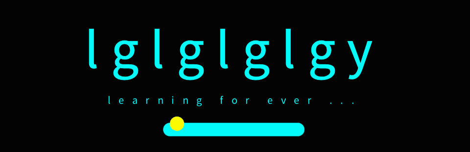

  

## Introduction

Hello there! 👋 I am a second-year university student with a passion for computer science and technology. I focus on high-performance computing and the realm of artificial intelligence.

- Email: [2661896437@qq.com](mailto:2661896437@qq.com)

## Recommended Projects

In recent work, I have been actively submitting code to the [OpenBLAS](https://github.com/OpenMathLib/OpenBLAS) project, with contributions primarily centered around performance optimizations on RISC-V using RVV (RISC-V Vector Extension).

Detailed contributions are available on my other account [guoyuanplct](https://github.com/guoyuanplct) .

  
| PR contributions                                        | 
|---------------------------------------------------------|
| [Optimizing the Implementation of GEMV on the RISC-V V Extension](https://github.com/OpenMathLib/OpenBLAS/pull/5211)                                        |
| [Optimized RVV_ZVL256B Implementation of zgemv_n ](https://github.com/OpenMathLib/OpenBLAS/pull/5245)                                      | 
| [Fixed the bug of openblas_utest_ext failing in c/zgemv](https://github.com/OpenMathLib/OpenBLAS/pull/5262)                                           |
|[Added support for omatcopy on RISCV64_ZVL256B](https://github.com/OpenMathLib/OpenBLAS/pull/5265)|
  
  

  

 
